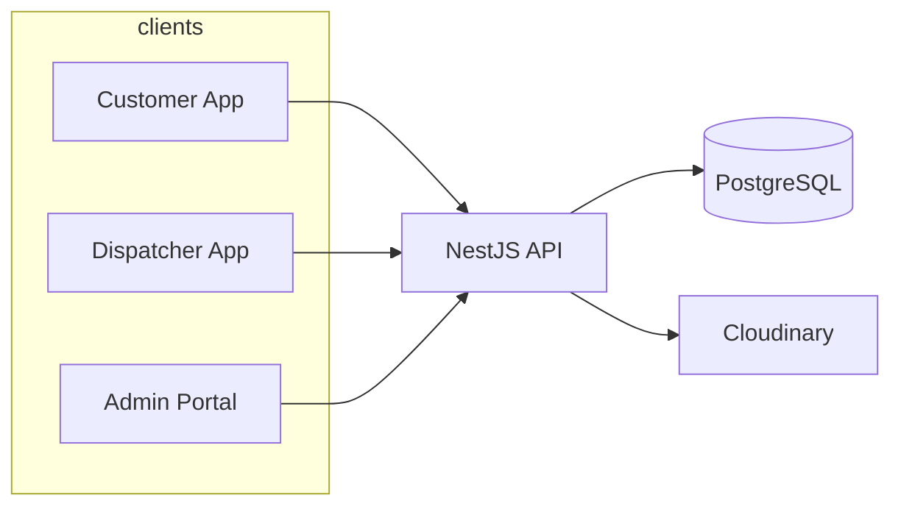
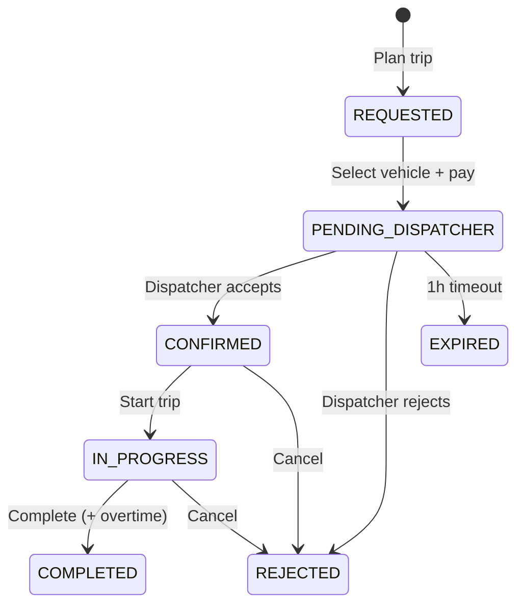

# Muhafiz Armour: Product & Feature Overview

## 1. Executive summary

**Muhafiz Armour** is a three-sided marketplace for booking **armoured vehicles** with professional dispatchers. Customers plan trips in a mobile app, choose from an approved fleet, and pay to confirm. **Dispatchers** (fleet operators) register vehicles, accept jobs, and run trips. **Platform admins** govern approvals, catalog options, and operations through a web dashboard.

The product is built as:

| Layer | Technology | Audience |
|--------|------------|----------|
| Mobile app (`armoured`) | React Native / Expo | End users & dispatchers |
| API (`server`) | NestJS, Prisma, PostgreSQL | All clients |
| Admin portal (`admin`) | Next.js | Internal operations |

Primary geography is **Pakistan** (city picker, intercity vs intracity scheduling rules).

---

## 2. Business model & value proposition

| Stakeholder | Value |
|-------------|--------|
| **Customer** | Book vetted armoured transport with clear pricing, schedule, and trip lifecycle visibility |
| **Dispatcher** | List fleet, receive matched requests, manage active trips and extensions |
| **Platform** | Quality control (approvals), catalog governance, metrics, and dispute-ready booking records |

Revenue logic is **hourly**: `baseRatePerHour` for the planned window; **extension** hours may use a separate `extensionRatePerHour`; **overtime** at trip completion is billed from actual end vs planned end.

---

## 3. Platform architecture (high level)

---

## 4. User roles & access

### 4.1 Customer (User)

- Sign up / log in (email + password; phone on record)
- Profile and avatar
- Full booking journey and trip management
- Switch to dispatcher mode from profile (if they also operate fleet)

### 4.2 Dispatcher

- Separate signup/login (dispatcher role)
- **Admin approval required** before vehicles appear in production matching (`isApproved`)
- Fleet registration, incoming requests, trip execution
- Extension approve/decline

### 4.3 Administrator

- Env-based credentials (`ADMIN_USERNAME` / `ADMIN_PASSWORD`)
- JWT role `ADMIN`
- Read-only operations dashboard plus governance actions (no trip driving)

---

## 5. Feature catalog

### A. Authentication & identity

| Feature | Description |
|---------|-------------|
| Dual-role login | Single login screen toggles User vs Dispatcher |
| Email/password auth | Signup and login with hashed passwords (scrypt) |
| Phone identity | Phone stored as unique identifier; legacy phone-only login path for users |
| JWT sessions | Role-scoped tokens for API access |
| Profile management | View/update name; upload profile photo (Cloudinary) |
| Account blocking | Blocked users cannot create bookings |
| Role switching | User profile can switch to dispatcher experience (stored active role) |

---

### B. Trip planning & scheduling (customer)

| Feature | Description |
|---------|-------------|
| New booking flow | Pickup/drop **city** (Pakistan cities list) + map pin per leg |
| Route metadata API | Distance (haversine), minimum duration, buffer minutes, max 120h booking |
| Intracity vs intercity rules | **2h** buffer each side (intracity); **5h** buffer (intercity) for scheduling conflicts |
| Minimum trip duration | At least **10 hours** or distance-based minimum (≈45 km/h), whichever is higher |
| Trip schedule UI | Start/end datetime selection within platform limits |
| Trip draft state | Client-side draft (`tripDraft` store) across setup → vehicle → payment screens |
| Availability check | Per-vehicle window check before confirm |
| Reschedule draft | Extend `endTime` on `REQUESTED` bookings only |

---

### C. Vehicle discovery & catalog

| Feature | Description |
|---------|-------------|
| Public vehicle browse | Filter by armour level, vehicle type, city, price band, time window |
| Vehicle detail | Specs, images, rates, dispatcher info |
| Armour level catalog | Admin-managed options (e.g. B4, B6); codes used on vehicles |
| Vehicle type catalog | Admin-managed types (sedan, SUV, etc.) |
| Matching engine | Returns approved, available vehicles with no buffer conflict for requested window |
| Sorting | Cheapest `baseRatePerHour` first among matches |
| Estimated price | `baseRatePerHour × duration` shown in options list |

---

### D. Booking lifecycle (core marketplace)

**Statuses:** `REQUESTED` → `PENDING_DISPATCHER` → `CONFIRMED` → `IN_PROGRESS` → `COMPLETED` (also `REJECTED`, `EXPIRED`)

| Stage | Feature | Description |
|-------|---------|-------------|
| Draft | Request booking | Creates booking with route, coords, buffer; returns matched vehicle options |
| Select vehicle | Assign vehicle + dispatcher | Moves to `PENDING_DISPATCHER`, sets `totalPrice`, marks vehicle `BOOKED` |
| Payment screen | Digital or Cash (UI) | Confirms selection via API after “payment” step |
| Dispatcher SLA | 1-hour accept window | `PENDING_DISPATCHER` expires to `EXPIRED`; countdown in app |
| Dispatcher response | Accept / reject | Accept → `CONFIRMED`; reject → frees vehicle |
| Trip start | Dispatcher starts trip | `IN_PROGRESS`, records `actualStartTime` |
| Trip complete | Dispatcher completes | `COMPLETED`, `actualEndTime`, **overtime** minutes & adjusted `totalPrice` |
| Cancel (user) | User cancel API | For eligible states |
| Cancel (dispatcher) | Dispatcher cancel | Confirmed/in-progress trips |
| Overlap protection | One active booking per user | Prevents conflicting windows |
| Idempotent request | Duplicate submit within 2 min | Returns existing draft instead of duplicate |

---

### E. Trip extensions

| Feature | Description |
|---------|-------------|
| User requests extension | Add hours (up to 120h total trip cap); uses `extensionRatePerHour` for added cost |
| Pending extension | `BookingExtensionRequest` with proposed end time and price |
| Dispatcher approve/decline | Updates booking end/price or rejects request |
| User cancel extension | Withdraw pending request |
| Conflict check | Extension must not clash with other bookings on same vehicle (buffer-aware) |

---

### F. Dispatcher / fleet operations

| Feature | Description |
|---------|-------------|
| Dispatcher home | Active/upcoming trip cards, quick navigation |
| Incoming requests | List `PENDING_DISPATCHER` with expiry |
| Active bookings | Confirmed + in-progress with extension info |
| Completed history | Past trips |
| Register vehicle (3-step) | Armour level, type, model, rates, location, photos |
| Vehicle list | Own fleet with status |
| Profile photo | Dispatcher avatar upload |
| Trip actions | Accept/reject, start, complete, cancel |
| Extension governance | Approve/decline extension requests |
| Approval gate | New dispatchers/vehicles need admin approval (enforced in production) |

**Vehicle statuses:** `AVAILABLE`, `BOOKED`, `MAINTENANCE`, `BLOCKED`

---

### G. Customer app experience

| Screen / area | Features |
|---------------|----------|
| **Home** | Greeting, avatar, active trip hero, upcoming booking, “New booking”, support email |
| **Activities** | Tabs: Upcoming / Completed / Canceled; pending expiry countdown |
| **Profile** | Member since, avatar upload, logout, switch to dispatcher |
| **Booking details** | Full trip info; live mode for in-progress; extend/cancel flows |
| **Ongoing trip** | Redirects to booking details (live) |
| **Support** | `mailto:support@muhafizarmour.com` |

---

### H. Admin portal (“Armored Ops”)

| Module | Features |
|--------|----------|
| **Dashboard** | Metrics: users, dispatchers, vehicles, bookings (total, completed, active, pending dispatcher) |
| **Bookings** | List + detail (route, parties, vehicle, price, overtime, timestamps) |
| **Dispatchers** | List, detail, approve, block |
| **Vehicles** | List, detail, approve, edit fields (rates, status, metadata) |
| **Users** | List, detail, block |
| **Catalog** | CRUD armour levels & vehicle types (sort order, active flag, safe delete rules) |

---

### I. Media & infrastructure

| Feature | Description |
|---------|-------------|
| Cloudinary uploads | Vehicle images and profile photos |
| Deployed API | Mobile app targets production API (e.g. Vercel-hosted backend) |
| PostgreSQL + Prisma | Relational data model with migrations |
| Role guards | JWT + role decorators on protected routes |

---

## 6. Booking state machine (reference)

---

## 7. Pricing & business rules (summary)

| Rule | Value / behavior |
|------|------------------|
| Max booking length | 120 hours |
| Dispatcher accept timeout | 60 minutes |
| Scheduling buffer | 2h (same city) / 5h (intercity), applied both sides |
| Min duration | max(10h, ceil(distance_km / 45)) |
| Base price | `baseRatePerHour × planned hours` at selection |
| Extension price | `extensionRatePerHour × additional hours` (additive to prior total) |
| Overtime | Charged at completion if actual end > planned end (`baseRatePerHour`) |
| Production matching | Only approved dispatchers + approved vehicles |

---

## 8. Data entities (business view)

| Entity | Purpose |
|--------|---------|
| **User** | Customer account |
| **Dispatcher** | Fleet operator account |
| **Vehicle** | Armoured asset with rates, location, approval |
| **Booking** | Trip contract linking user, dispatcher, vehicle, route, times, price |
| **BookingExtensionRequest** | Formal extension proposal and resolution |
| **ArmourLevelOption / VehicleTypeOption** | Platform taxonomy |

---

## 9. Out of scope / limitations (current build)

- **Payment integration** is represented in UI (Digital/Cash); confirmation is API-driven after the payment step, not a live payment gateway in code reviewed.
- **No native push notifications** observed; expiry uses polling/countdown UI.
- **No in-app GPS tracking** for live trips; “live” mode is booking-detail focused.
- **Admin** does not create bookings or drive trips; governance and visibility only.
- **MAINTENANCE** vehicle status exists in schema; dispatcher-facing maintenance workflows are limited.

---

## 10. Positioning (one-liner)

> **Muhafiz Armour** is a Pakistan-focused armoured mobility marketplace: customers book protected transport with transparent hourly pricing; vetted dispatchers fulfill trips through a structured request → confirm → execute → complete workflow with admin oversight and extension handling.
